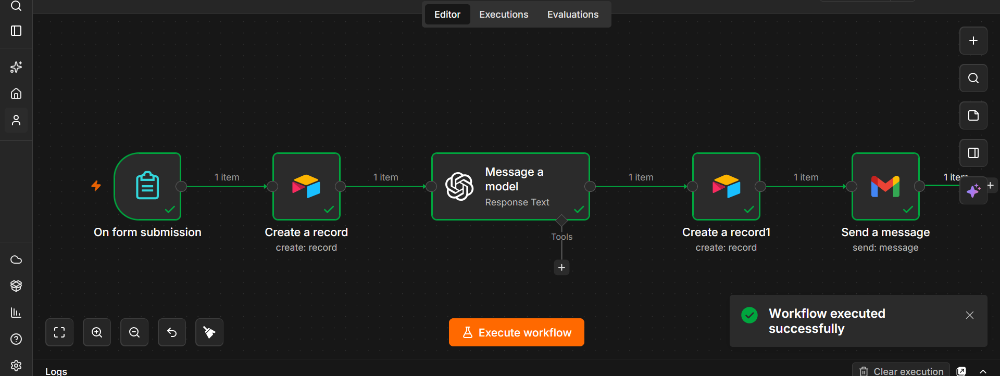

# AI Customer Support Automation

## Overview

An AI-powered customer support automation workflow built with n8n, Airtable, an AI model, and Gmail.

The workflow automates the process of receiving customer enquiries, storing the enquiry, generating an AI-assisted response, recording the result, and sending the response by email.

## Workflow 



###  Workflow File
The complete n8n8 workflow is available here:

[AI Customer Support Automation.json](https://github.com/user-attachments/files/30869972/AI.Customer.Support.Automation.json)

{
  "name": "AI Customer Support Automation",
  "nodes": [
    {
      "parameters": {
        "formTitle": "AI Customer Support ",
        "formDescription": "please complete this form and upload your resume. We will get back to you soon",
        "formFields": {
          "values": [
            {
              "fieldLabel": "Full name",
              "requiredField": true
            },
            {
              "fieldLabel": "Email",
              "fieldType": "email",
              "requiredField": true
            },
            {
              "fieldLabel": "Phone number",
              "fieldType": "number",
              "requiredField": true
            },
            {
              "fieldLabel": "Years of experience",
              "fieldType": "number",
              "requiredField": true
            },
            {
              "fieldLabel": " Skills",
              "fieldType": "textarea",
              "requiredField": true
            },
            {
              "fieldLabel": "Education",
              "fieldType": "textarea",
              "requiredField": true
            },
            {
              "fieldLabel": "Resume",
              "fieldType": "file",
              "requiredField": true
            }
          ]
        },
        "options": {}
      },
      "type": "n8n-nodes-base.formTrigger",
      "typeVersion": 2.6,
      "position": [
        0,
        0
      ],
      "id": "6cdc1647-008a-400c-af44-c7ae6bd00839",
      "name": "On form submission",
      "webhookId": "a5ca1d8e-b60c-444c-a358-aced91caccca"
    },
    {
      "parameters": {
        "operation": "create",
        "base": {
          "__rl": true,
          "value": "app0pxtXx9vgh0zIM",
          "mode": "list",
          "cachedResultName": "Recruitment system",
          "cachedResultUrl": "https://airtable.com/app0pxtXx9vgh0zIM"
        },
        "table": {
          "__rl": true,
          "value": "tble0bCUADcr2cEEn",
          "mode": "list",
          "cachedResultName": "Applicant1",
          "cachedResultUrl": "https://airtable.com/app0pxtXx9vgh0zIM/tble0bCUADcr2cEEn"
        },
        "columns": {
          "mappingMode": "defineBelow",
          "value": {
            "experience": 0,
            "AI Score": 0
          },
          "matchingColumns": [],
          "schema": [
            {
              "id": "Applicant name",
              "displayName": "Applicant name",
              "required": false,
              "defaultMatch": false,
              "canBeUsedToMatch": true,
              "display": true,
              "type": "string",
              "readOnly": false,
              "removed": false
            },
            {
              "id": "Email",
              "displayName": "Email",
              "required": false,
              "defaultMatch": false,
              "canBeUsedToMatch": true,
              "display": true,
              "type": "string",
              "readOnly": false,
              "removed": false
            },
            {
              "id": "phone",
              "displayName": "phone",
              "required": false,
              "defaultMatch": false,
              "canBeUsedToMatch": true,
              "display": true,
              "type": "string",
              "readOnly": false,
              "removed": false
            },
            {
              "id": "experience",
              "displayName": "experience",
              "required": false,
              "defaultMatch": false,
              "canBeUsedToMatch": true,
              "display": true,
              "type": "number",
              "readOnly": false,
              "removed": false
            },
            {
              "id": "skills",
              "displayName": "skills",
              "required": false,
              "defaultMatch": false,
              "canBeUsedToMatch": true,
              "display": true,
              "type": "string",
              "readOnly": false,
              "removed": false
            },
            {
              "id": "education",
              "displayName": "education",
              "required": false,
              "defaultMatch": false,
              "canBeUsedToMatch": true,
              "display": true,
              "type": "string",
              "readOnly": false,
              "removed": false
            },
            {
              "id": "resume",
              "displayName": "resume",
              "required": false,
              "defaultMatch": false,
              "canBeUsedToMatch": true,
              "display": true,
              "type": "array",
              "readOnly": false,
              "removed": false
            },
            {
              "id": "AI Score",
              "displayName": "AI Score",
              "required": false,
              "defaultMatch": false,
              "canBeUsedToMatch": true,
              "display": true,
              "type": "number",
              "readOnly": false,
              "removed": false
            },
            {
              "id": "Strenths",
              "displayName": "Strenths",
              "required": false,
              "defaultMatch": false,
              "canBeUsedToMatch": true,
              "display": true,
              "type": "string",
              "readOnly": false,
              "removed": false
            },
            {
              "id": "Weakness",
              "displayName": "Weakness",
              "required": false,
              "defaultMatch": false,
              "canBeUsedToMatch": true,
              "display": true,
              "type": "string",
              "readOnly": false,
              "removed": false
            },
            {
              "id": "Recommendation",
              "displayName": "Recommendation",
              "required": false,
              "defaultMatch": false,
              "canBeUsedToMatch": true,
              "display": true,
              "type": "string",
              "readOnly": false,
              "removed": false
            }
          ],
          "attemptToConvertTypes": false,
          "convertFieldsToString": false
        },
        "options": {}
      },
      "type": "n8n-nodes-base.airtable",
      "typeVersion": 2.2,
      "position": [
        224,
        0
      ],
      "id": "21fcb547-8175-4221-9530-0d080309a097",
      "name": "Create a record",
      "credentials": {
        "airtableTokenApi": {
          "id": "mXOeoxHq3QYGxm1j",
          "name": "Airtable Personal Access Token account 2"
        }
      }
    },
    {
      "parameters": {
        "modelId": {
          "__rl": true,
          "value": "gpt-4.1-mini",
          "mode": "list",
          "cachedResultName": "GPT-4.1-MINI"
        },
        "responses": {
          "values": [
            {
              "content": "=You are an AI recruitment assistant.\n\nReview the following job application for a Junior Data Analyst role.\n\nApplicant Name: {{ $json[\"Applicant name\"] }}\nEmail: {{ $json[\"Email\"] }}\nEducation: {{ $json[\"Education\"] }}\nSkills: {{ $json[\"Skil ls\"] }}\nExperience:\n\nEvaluate the applicant and return:\n\nOverall Score: __/100\n\nStrengths:\n- ...\n\nWeaknesses:\n- ...\n\nRecommendation:\nInterview or Reject"
            }
          ]
        },
        "builtInTools": {},
        "options": {}
      },
      "type": "@n8n/n8n-nodes-langchain.openAi",
      "typeVersion": 2.3,
      "position": [
        448,
        0
      ],
      "id": "8f74bdef-5772-4923-b470-1942275eeb03",
      "name": "Message a model",
      "credentials": {
        "openAiApi": {
          "id": "fRQD5sHsUUhCecYp",
          "name": "n8n free OpenAI API credits"
        }
      }
    },
    {
      "parameters": {
        "operation": "create",
        "base": {
          "__rl": true,
          "value": "app0pxtXx9vgh0zIM",
          "mode": "list",
          "cachedResultName": "Recruitment system",
          "cachedResultUrl": "https://airtable.com/app0pxtXx9vgh0zIM"
        },
        "table": {
          "__rl": true,
          "value": "tble0bCUADcr2cEEn",
          "mode": "list",
          "cachedResultName": "Applicant1",
          "cachedResultUrl": "https://airtable.com/app0pxtXx9vgh0zIM/tble0bCUADcr2cEEn"
        },
        "columns": {
          "mappingMode": "defineBelow",
          "value": {
            "full name": "={{ $('On form submission').item.json['Full name'] }}",
            "Email": "={{ $('On form submission').item.json.Email }}",
            "phone": "={{ $('On form submission').item.json['Phone number'] }}",
            "experience": "={{ $('On form submission').item.json['Years of experience'] }}",
            "skills": "={{ $('On form submission').item.json[' Skills'] }}",
            "education": "={{ $('On form submission').item.json.Education }}"
          },
          "matchingColumns": [],
          "schema": [
            {
              "id": "full name",
              "displayName": "full name",
              "required": false,
              "defaultMatch": false,
              "canBeUsedToMatch": true,
              "display": true,
              "type": "string",
              "readOnly": false,
              "removed": false
            },
            {
              "id": "Email",
              "displayName": "Email",
              "required": false,
              "defaultMatch": false,
              "canBeUsedToMatch": true,
              "display": true,
              "type": "string",
              "readOnly": false,
              "removed": false
            },
            {
              "id": "phone",
              "displayName": "phone",
              "required": false,
              "defaultMatch": false,
              "canBeUsedToMatch": true,
              "display": true,
              "type": "number",
              "readOnly": false,
              "removed": false
            },
            {
              "id": "experience",
              "displayName": "experience",
              "required": false,
              "defaultMatch": false,
              "canBeUsedToMatch": true,
              "display": true,
              "type": "number",
              "readOnly": false,
              "removed": false
            },
            {
              "id": "skills",
              "displayName": "skills",
              "required": false,
              "defaultMatch": false,
              "canBeUsedToMatch": true,
              "display": true,
              "type": "string",
              "readOnly": false,
              "removed": false
            },
            {
              "id": "education",
              "displayName": "education",
              "required": false,
              "defaultMatch": false,
              "canBeUsedToMatch": true,
              "display": true,
              "type": "string",
              "readOnly": false,
              "removed": false
            },
            {
              "id": "resume",
              "displayName": "resume",
              "required": false,
              "defaultMatch": false,
              "canBeUsedToMatch": true,
              "display": true,
              "type": "array",
              "readOnly": false,
              "removed": true
            },
            {
              "id": "AI Score",
              "displayName": "AI Score",
              "required": false,
              "defaultMatch": false,
              "canBeUsedToMatch": true,
              "display": true,
              "type": "number",
              "readOnly": false,
              "removed": false
            },
            {
              "id": "Strenths",
              "displayName": "Strenths",
              "required": false,
              "defaultMatch": false,
              "canBeUsedToMatch": true,
              "display": true,
              "type": "string",
              "readOnly": false,
              "removed": false
            },
            {
              "id": "Weakness",
              "displayName": "Weakness",
              "required": false,
              "defaultMatch": false,
              "canBeUsedToMatch": true,
              "display": true,
              "type": "string",
              "readOnly": false,
              "removed": false
            },
            {
              "id": "Recommendation",
              "displayName": "Recommendation",
              "required": false,
              "defaultMatch": false,
              "canBeUsedToMatch": true,
              "display": true,
              "type": "string",
              "readOnly": false,
              "removed": false
            }
          ],
          "attemptToConvertTypes": false,
          "convertFieldsToString": false
        },
        "options": {}
      },
      "type": "n8n-nodes-base.airtable",
      "typeVersion": 2.2,
      "position": [
        816,
        0
      ],
      "id": "eb417c39-8a21-4263-98ed-223eebe3001a",
      "name": "Create a record1",
      "credentials": {
        "airtableTokenApi": {
          "id": "mXOeoxHq3QYGxm1j",
          "name": "Airtable Personal Access Token account 2"
        }
      }
    },
    {
      "parameters": {
        "sendTo": "={{ $json.fields.Email }}",
        "subject": "application received",
        "emailType": "text",
        "message": "=Dear {{$json.fields[\"Full Name\"]}},  Thank you for applying. We have received your application successfully.  Our recruitment team will review it and contact you if you are shortlisted.  Best regards, HR Team",
        "options": {}
      },
      "type": "n8n-nodes-base.gmail",
      "typeVersion": 2.2,
      "position": [
        1040,
        0
      ],
      "id": "7670fbc6-f42d-4b74-9e8e-6e6e89e51a16",
      "name": "Send a message",
      "webhookId": "e82a35a2-d728-420b-a8fa-8dbeac897c21",
      "credentials": {
        "gmailOAuth2": {
          "id": "QDJU2ctEdfjBg7oD",
          "name": "Gmail account"
        }
      }
    }
  ],
  "pinData": {},
  "connections": {
    "On form submission": {
      "main": [
        [
          {
            "node": "Create a record",
            "type": "main",
            "index": 0
          }
        ]
      ]
    },
    "Create a record": {
      "main": [
        [
          {
            "node": "Message a model",
            "type": "main",
            "index": 0
          }
        ]
      ]
    },
    "Message a model": {
      "main": [
        [
          {
            "node": "Create a record1",
            "type": "main",
            "index": 0
          }
        ]
      ]
    },
    "Create a record1": {
      "main": [
        [
          {
            "node": "Send a message",
            "type": "main",
            "index": 0
          }
        ]
      ]
    }
  },
  "active": true,
  "settings": {
    "executionOrder": "v1",
    "binaryMode": "separate",
    "availableInMCP": false
  },
  "versionId": "7942188a-0adc-4952-8c3a-bc592f32dc21",
  "meta": {
    "templateCredsSetupCompleted": true,
    "instanceId": "6738446cc2bc76dd73b71c75d7d083ecd6e81d44d38545115d5cbe57ba52116b"
  },
  "nodeGroups": [],
  "id": "fEDJm2mCsgERghd3",
  "tags": []
}


Customer Form Submission
→ Airtable
→ AI Model
→ Airtable
→ Gmail

## How It Works

1. **Form Submission**  
   A customer submits an enquiry through a form.

2. **Store Customer Enquiry**  
   The submitted information is recorded in Airtable.

3. **AI Response Generation**  
   The enquiry is sent to an AI model to generate an appropriate response.

4. **Store AI Response**  
   The generated response is saved in Airtable for record keeping.

5. **Email Response**  
   Gmail automatically sends the response to the customer.

## Tools & Technologies

- n8n
- Airtable
- AI/LLM integration
- Gmail
- Form Trigger
- Workflow Automation

## Key Automation Features

- Automated customer enquiry intake
- Automated data storage
- AI-assisted response generation
- Automated response tracking
- Automated email communication
- Multi-step workflow orchestration

## Business Value

This automation reduces repetitive customer-support tasks by connecting customer enquiries, data storage, AI response generation, and email communication into a single workflow.

It can help businesses respond faster while maintaining organized records of customer interactions.

## Project Architecture

```text
Customer
   ↓
Form Submission
   ↓
Airtable
   ↓
AI Model
   ↓
Airtable
   ↓
Gmail
   ↓
Customer Response

## Project Status
Completed
## Author

**CP Automations**

AI Automation Engineer specializing in AI-powered workflows, API integrations, and business process automation.


